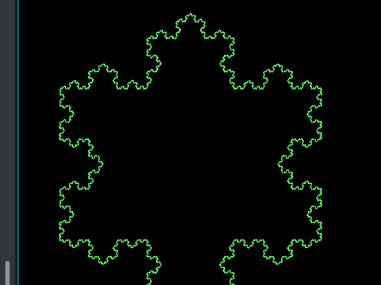

[](https://travis-ci.com/TralahM/KochFractal)
[](https://KochFractal.readthedocs.io/en/latest/?badge=latest)
[](https://opensource.org/licenses/MIT)
[](https://github.com/TralahTek)
[](http://dwyl.io/TralahM/KochFractal)
[](https://github.com/TralahM/KochFractal/pull/)
[](https://github.com/TralahM/KochFractal/pull/)
[](https://github.com/TralahM)

# KochFractal.
Koch Fractal is a simple algorithm which produces snowflake from a triangle. The concept behind this, is to break a line into two while leaving one third of the space between them where we fit two more lines forming an equilateral triangle without the base. This process is, then repeated to all lines again and again!


[](https://github.com/TralahTek)
[](https://github.com/TralahM)
[](https://github.com/TralahM)

# Documentation

[](https://github.com/TralahM/KochFractal)

# Building the Program

```
# In terminal do:
$  git clone https://github.com/TralahM/KochFractal.git
$  cd KochFractal
```

## Using Make

```bash
# In terminal do:
$  make
```
## Manually

```bash
# In terminal do:
$ g++ main.cpp -o kochfractal -lSDL2
$ ./kochfractal
```

# Output



# Contributing
[See the Contributing File](CONTRIBUTING.rst)


[See the Pull Request File](PULL_REQUEST_TEMPLATE.md)


# Support

# LICENCE

[Read the license here](LICENSE)


# Self-Promotion

[](https://twitter.com/TralahM)
[](https://github.com/TralahM)
[](https://kaggle.com/TralahM)
[](https://linkedin.com/in/TralahM)
[](https://tralahm.tralahtek.com)
[](https://tralahtek.com)


